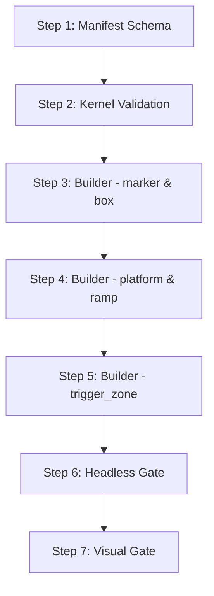

# GodotSim Automation: Ollama & Aider Chunking Blueprint

Smaller local models (like `qwen2.5-coder:7b-instruct` at 7B parameters) are highly capable at code generation, but they suffer from **generation speed bottlenecks** and **context distraction** when asked to perform large, multi-file edits in a single run. Attempting to implement a large feature (like a whole recipe pack or complex physics movement) in a single Aider call leads to edit-format syntax errors and process timeouts.

To run local models successfully in production without human intervention or premium APIs, tasks must be broken down into a **sequential pipeline of micro-tasks**.

---

## The Chunking Doctrine: Four Core Rules

### Rule 1: One Target File per Aider Command
Never ask Aider to edit the validation kernel, modify the builder, and write a new gate in a single prompt. 
* **Bad:** "Add validation support for markers and boxes, update the builder to serialize them, and create the gate."
* **Good (Step 1):** "Update the builder `godot_scene_piece_builder.py` to serialize `marker` nodes."
* **Good (Step 2):** "Update the builder `godot_scene_piece_builder.py` to serialize `box` nodes."

### Rule 2: Keep Aider's Chat Context Small
Aider includes files in the LLM chat context using git and the repository map. If you add 5 files to the chat, the model gets overwhelmed by token overhead.
* Always launch Aider only with the target file being edited:
  `aider tier2/godotsim/builders/godot_scene_piece_builder.py`
* Reference other files read-only in the message text if needed, rather than adding them as editable files.

### Rule 3: Use Micro-Prompts with Assertions
Provide Aider with the exact target changes and immediate shell command feedback. Instruct the model to make the change and verify it.
* **Prompt:** "Add `marker` type serialization to `build_godot_scene`. Only support `marker` in this step. Once done, verify the syntax compiles using `python3 -m py_compile tier2/godotsim/builders/godot_scene_piece_builder.py`."

### Rule 4: Optimize Edit Formats for Local Models
For local models, generating precise search/replace blocks or diff blocks can trigger formatting errors. Aider's troubleshooting documentation officially recommends using `--edit-format whole` for weaker or local models. This forces the model to return the entire modified file cleanly, which is the most reliable mode for 7B/8B class models.
* Configure Aider to use:
  `--edit-format whole`
* Do **not** use custom/invalid flags (like `str-replace`). For Gemini models specifically, `diff-fenced` can be used, but for Ollama-based models, `whole` is preferred.

---

## Example: Chunking Recipe Pack 001

To add multiple piece types cleanly, split the changes by layer (manifest -> validation -> builder) and then by component groupings to avoid any gaps:



### Scripted Execution Example
Run the commands sequentially in the pipeline:

```bash
# Step 1: Manifest edit (all 5 pieces defined in schema)
aider docs/contracts/.../piece_baseline_manifest.json \
  --edit-format whole \
  --message "Add marker, box, platform, ramp, and trigger_zone schemas to the manifest pieces." --yes

# Step 2: Validation edit (all 5 pieces validation logic added to kernel)
aider tier2/godotsim/kernels/piece3d_mr.py \
  --edit-format whole \
  --message "Add validation functions for marker, box, platform, ramp, and trigger_zone pieces." --yes

# Step 3: Builder edit (marker and box)
aider tier2/godotsim/builders/godot_scene_piece_builder.py \
  --edit-format whole \
  --message "Add marker and box serialization support to the builder." --yes

# Step 4: Builder edit (platform and ramp)
aider tier2/godotsim/builders/godot_scene_piece_builder.py \
  --edit-format whole \
  --message "Add platform and ramp serialization support to the builder." --yes

# Step 5: Builder edit (trigger_zone)
aider tier2/godotsim/builders/godot_scene_piece_builder.py \
  --edit-format whole \
  --message "Add trigger_zone Area3D serialization support to the builder." --yes

# Step 6: Create baseline gate
aider tier2/godotsim/gates/gate_piece_recipe_pack_001.py \
  --edit-format whole \
  --message "Create a validation gate for the new recipe pieces. Run PYTHONPATH=. python3 gate_piece_recipe_pack_001.py to verify it passes." --yes

# Step 7: Create visual observer gate
aider tier2/godotsim/gates/gate_piece_recipe_pack_001_visible_proof.py \
  --edit-format whole \
  --message "Create a visual demo gate that launches the pieces without --headless." --yes
```
